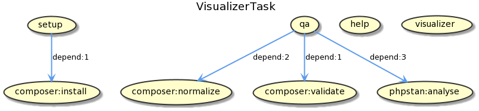
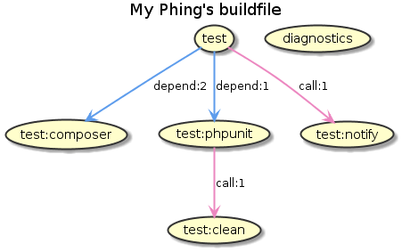

# VisualizerTask

**VisualizerTask creates diagrams using buildfiles, these diagrams represents calls and depends among targets.**

## Documentation

Phing User Guide:

- [VisualizerTask documentation](https://www.phing.info/guide/chunkhtml/VisualizerTask.html)

## Examples

## Contribute

If you liked this project, ⭐ star it on [GitHub](https://github.com/phingofficial/task-visualizer).

## License

This project is under the [GNU LGPL license](LICENSE.md).
